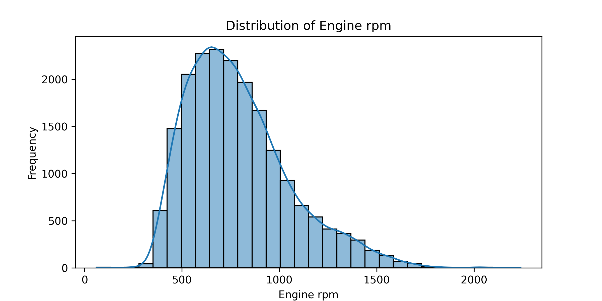

# predictive-maintenance-system

A POC on how engine data can be used to predict the maintainance status of vessels at PSA Marine using a Kaggle dataset. Task: using the given features like coolant presssure and fuel pressure, predict whether the engine needs maintainance (binary classification).

## Features Correlation matrix
This plot shows that the features have low correlation with each other, showing feature independence. As such, each feature will be a great addition for the modelling of this task.

## EDA on features
## Histogram of Engine RPM

## Boxplot of Engine RPM

## Model results
Trained 4 different models. Results summarised below

